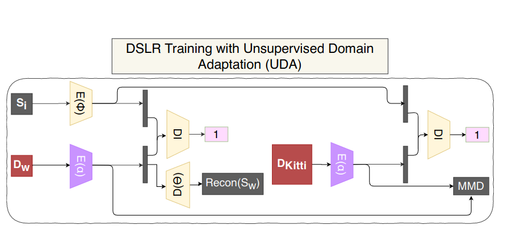

## DSLR UDA

`Adversarial_StSt_StDy_all_pairs_reconstruction_plugged_nc2_uda_disc.py` contains the code for Unsupervised Domain Adaptation applied to DSLR.

The changes happen in the third part of DSLR - Adversarial Training.

The changes mainly occur in 2 parts. Rest of the code is the exact same as base-DSLR.

1. Dataset
2. New Loss Function (MMD)

We load a new dataset called `pairKittyDynamic` in `Pairdata(Dataset)`. We also define a new MMD loss function alongside the usual reconstruction and discriminator loss.

Adversarial training along with UDA for domainadaptation on KITTI data. Purple color indicate trainable weights.

The training process is exactly same same as that of base-DSLR except for the fact that we pass in Dynamic Kitti images to calculate the MMD loss between Dyanmic KITTI and Dynamic CARLA datasets.

When static CARLA and dynamic CARLA are inputs, then we calculate the discriminator loss between them along with a reconstruction loss for the dyanmic carla. When dynamic KITTI is sent as in input, in place of dynamic CARLA, then we calculate the MMD loss instead of the reconstruction loss.
