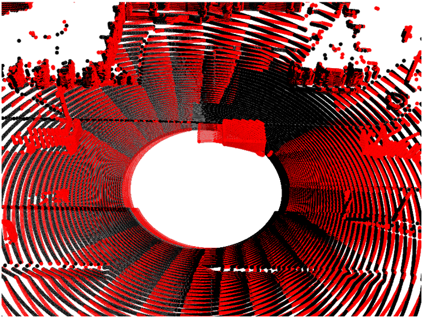
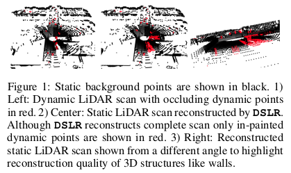
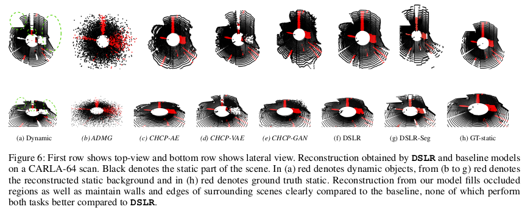

<p align="center"></p>

# DSLR: Dynamic to Static LiDAR Scan Reconstruction Using Adversarially Trained Autoencoder

[[Project Page]](https://dslrproject.github.io/dslr/)[[AAAI 2021 Conference Paper]](https://arxiv.org/abs/2105.12774)[[Appendix]](https://drive.google.com/file/d/17_O46lNyFqbstTfqN377qX0NMJZAuD1e/view)[[AAAI Presentation]](https://www.youtube.com/watch?v=Mi8DNw6F5Mk&ab_channel=PRASHANTKUMAR)

PyTorch implementation of our supervised image-to-image translation method for Dynamic to Static Reconstruction of LiDAR scans. Our model called DSLR works on range image based LiDAR data and uses an adversarially trained auto encoder via an input pair based discriminator.

Contact: Sabyasachi Sahoo (iamsabyasachisahoo@gmail.com) and Prashant Kumar(prshnttkmr@gmail.com)

## License
Copyright (c) 2021, Prashant Kumar, Sabyasachi Sahoo, Vanshil Shah, Vineetha Kondameedi, Abhinav Jain, Akshaj Verma, Chiranjib Bhattacharyya, Vinay V. All rights reserved under the [GNU General Public License v3.0
](https://choosealicense.com/licenses/gpl-3.0).

## Citation
Please cite our paper if you find the code or dataset useful for your research.

```
@article{DSLR,
  author = {Prashant Kumar, Sabyasachi Sahoo, Vanshil Shah, Vineetha Kondameedi, Abhinav Jain, Akshaj Verma, Chiranjib Bhattacharyya, Vinay V},
  title = {DSLR: Dynamic to Static LiDAR Scan Reconstruction Using Adversarially Trained Autoencoder},
  journal={Association for the Advancement of Artificial Intelligence},
  year={2021}
}
```

## Example Results
<p align="center"></p>



## Usage
Each folder contains a separate README.md that outlines the environment setup steps and steps for training/testing.
This repository has been divided into the following folders:
 - DSLR : for DSLR and DSLR-UDA models
 - Data : placeholder folder to download the data before training/testing
 - Data_Generation : for Paired Dataset generation algorithm and converting point cloud to range images.
 - LQI : for evaluating static scan reconstruction in absence of ground truth

All the data has been uploaded to kaggle servers. Please refer to "Data" folder for more information.


## Update: Results for DSLR on our new CARLA-64 simulated dataset
This dataset has more samples to train on and has  additional 8 lidar data blocks(each consisting of 2048 scans) for rigorous testing.
Note that these differnet data blocks correspond to differnet semantics(scenes, vehicles, pedestriasn) that were visible across the dataset.
The link for the dataset is updated in the DATA section. 
Training was done using corresponding static-dynamic pair 0-7.
Testing was done on 7 dataset that belong to differnet scenes in the CARLA simulator, to gauge the behaviour of our model.
Model is given input as the dynamic frame (eg d9.npy) and the recosntruction is tested against s9.npy The index column denotes the same.
Note that the test result were calculated on the first 1024 samples only for each of the index data block due to memory constraints.

| Index   | Chamfer Distance |
| ------- | ---------------- |
|  9      |      1.33        |
  10      |      1.57        |
| 11      |      1.24        |
| 12      |      8.44        |
| 13      |      1.04        |
| 14      |      2.57        |
| 15      |      1.37        |


Similarly, for ATI dataset we release a new single testing run, that combines all the scenes observes by the existing 6 testing runs, is more longer and has more loops compared to the previous testing runs.
Similarly, we release results for the sparse ARD-16 datasets on the test run:
 | Chamfer Distance |
 | ---------------- |
 |     0.3375       |  


## Acknowledgements
Code heavily inspired from [Deep Generative Modeling of LiDAR Data](https://github.com/pclucas14/lidar_generation)
